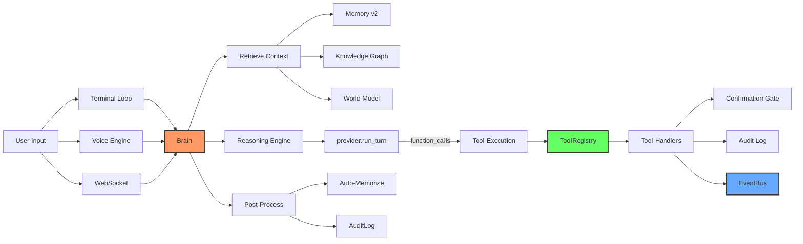
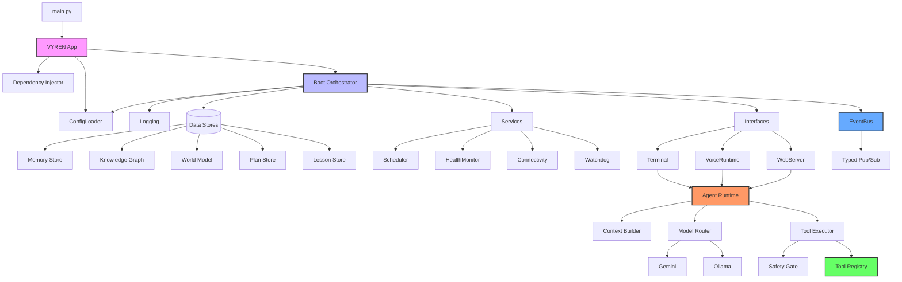

# VYREN v2 — Senior Architect Review

## 1. Architectural Weaknesses

### 1.1 Dual Wiring Paths (Critical)
**Files:** `core/__init__.py`, `runtime/manager.py`, `boot/manager.py`

The system has two parallel initialization paths that both claim to own subsystem wiring:
- `core.VYRENCtx` builds the full registry, system prompt, health checks, scheduler handlers, and brain.
- `runtime.manager.RuntimeManager` does the same via `BootManager` phases.

This creates maintenance hazards:
- Health checks are registered in both places with slightly different logic.
- System prompt construction is duplicated (`core._build_system_prompt` vs `runtime._init_brain`).
- Tool registry construction happens in `core._build_registry()` AND `runtime._init_tools()`.
- If one path is updated and the other isn't, behavior diverges silently.

**Impact:** High risk of state desync, double-initialization, and confusing bugs.

### 1.2 Global Mutable State
**Files:** `provider.py`, `memory.py`, `memory_v2.py`, `scheduler.py`, `event_bus.py`

Multiple module-level globals:
- `provider._run_ollama_last` — tracks offline mode across calls.
- `safety.kill_switch_active` — global boolean.
- `event_bus.py` uses class-level state but is often instantiated per-subsystem.
- `memory.py` and `memory_v2.py` both have their own file paths and stores.

This makes testing hard and introduces hidden coupling.

### 1.3 Inconsistent Context Ownership
**Files:** `brain/__init__.py`, `brain/reasoning.py`, `runtime/terminal.py`, `voice/runtime.py`, `server.py`

The `Brain` class takes `ctx: core.VYRENCtx`, but `reasoning.py` expects `ctx: dict`. The terminal loop, server, and voice runtime all reach into raw dicts. There's no typed interface for what a "context" provides.

This means:
- IDE support is poor.
- Refactoring is risky.
- It's unclear what keys are guaranteed to exist.

### 1.4 Placeholder Modules as First-Class Citizens
**Directories:** `models/`, `automation/`, `browser/`, `vision/`, `ui/`, `api/`

These directories exist but contain only `__init__.py` or minimal code. They bloat the tree and mislead contributors about actual capability.

### 1.5 Boot Phase Rigidity
**File:** `boot/manager.py`

Phases are a flat `IntEnum` with hard dependencies. Adding a new subsystem requires:
1. Adding a new enum value.
2. Registering it with explicit phase number.
3. Updating `runtime/manager.py` to wire it.

This is brittle. A dependency graph-based approach would be more flexible.

### 1.6 No Interface Contracts
There are no ABCs or Protocols for:
- Tools (`ToolDef` is a dataclass, but no interface for "can this tool run?").
- Agents (`BaseAgent` exists but `handle_task` is async while most callers are sync).
- Memory layers (`MemoryStore` vs `MemoryStore` name collision in `memory.py` vs `memory_v2.py`).

### 1.7 Security Theater
**File:** `security/__init__.py`

The `CredentialVault` uses base64 encoding, which is obfuscation, not encryption. The docstring admits this but ships it anyway. The permission system (`PermissionStore`) is not actually wired into tool execution — `safety.py` uses `config.is_consequential()` directly.

## 2. Code Smells and Anti-Patterns

### 2.1 Massive God Classes/Files
- `runtime/manager.py` (879 lines): boot, supervision, signal handling, greeting sequencing, status printing, proactive assistance.
- `server.py` (504 lines): REST routes, WebSocket chat, slash commands, post-confirmation execution.
- `brain/__init__.py` (248 lines): context retrieval, mode selection, prompt building, tool execution loop, post-processing.
- `provider.py` (266 lines): two provider implementations plus fallback logic.

### 2.2 Duplicate Post-Confirmation Execution
**Files:** `brain/__init__.py` lines 179-217, `server.py` lines 441-481, `runtime/terminal.py` lines 364-403

The same sentinel-based post-confirmation logic (`shutdown_system`, `restart_system`, `delete_file`, `edit_file`, `run_python`) is copy-pasted three times. Any change must be applied in three places.

### 2.3 Duplicate System Prompt Construction
**Files:** `core/__init__.py` `_build_system_prompt`, `brain/reasoning.py` `refresh_system_prompt`, `voice/runtime.py` `_build_system_prompt`

All three build similar prompts from memory/world/KG context with slight variations. This is a classic copy-paste divergence risk.

### 2.4 Duplicate Health Check Registration
**Files:** `core/__init__.py` `_register_health_checks`, `runtime/manager.py` `_init_monitoring`

Both register `gemini_api`, `memory`, `knowledge_graph`, `scheduler` checks with similar lambda bodies.

### 2.5 Duplicate Scheduler Job Registration
**Files:** `core/__init__.py` `_register_scheduler_handlers`, `runtime/manager.py` `_init_monitoring`

Both register `health_check`, `watchdog_check`, `memory_consolidate` handlers and schedule them at 600s and 3600s intervals.

### 2.6 Stringly-Typed Event System
**File:** `event_bus.py`

Event types are string constants. There's no validation that subscribers handle the right event shape. A typo in an event type string silently breaks the subscription.

### 2.7 Broad Exception Swallowing
Multiple files catch `Exception` and log it, returning generic error strings. Examples:
- `knowledge_graph.py` `_load`: catches `(json.JSONDecodeError, IOError)` and silently initializes empty state.
- `memory_v2.py` `_load`: same pattern.
- `world_model.py` `_load`: catches `(json.JSONDecodeError, IOError, TypeError)`.

This makes data corruption invisible.

### 2.8 Inconsistent Return Conventions
Tools return strings with status tags (`[TOOL_STATUS: SUCCESS]`), but some tools return raw strings. The `_classify` method in `tools/__init__.py` tries to infer status from text content, which is fragile.

### 2.9 Mixed Async/Sync Boundaries
- `EventBus.publish_sync` schedules async handlers on a loop but can't await them.
- `server.py` runs sync `run_turn` in `run_in_executor` but the surrounding code is async.
- `voice/runtime.py` uses `asyncio.to_thread` for sync tool execution.

This leads to subtle race conditions and makes reasoning about flow control difficult.

### 2.10 Hardcoded Paths and Windows Assumptions
**Files:** `runtime/manager.py`, `server.py`, `tools/system_tools.py`

- `VYREN_DIR = Path(os.path.expanduser("~/.vyren"))` is hardcoded in multiple files.
- `server.py` uses `C:\\` for Windows disk root.
- `tools/system_tools.py` uses `/` for disk root, which fails on Windows.
- Shutdown commands are Windows-specific (`shutdown /s /t 5`).

## 3. Duplicate Logic

### 3.1 Post-Confirmation Execution
As noted in 2.2, the exact same sentinel-based execution logic exists in:
- `brain/__init__.py:179-217`
- `server.py:441-481`
- `runtime/terminal.py:364-403`

### 3.2 System Prompt Assembly
Similar prompt-building logic in:
- `core/__init__.py:_build_system_prompt`
- `brain/reasoning.py:refresh_system_prompt`
- `voice/runtime.py:_build_system_prompt`

### 3.3 Health Check Registration
Similar lambda-based health checks in:
- `core/__init__.py:_register_health_checks`
- `runtime/manager.py:_init_monitoring`

### 3.4 Scheduler Handler Registration
Similar handler registration in:
- `core/__init__.py:_register_scheduler_handlers`
- `runtime/manager.py:_init_monitoring`

### 3.5 Memory Context Building
`memory.py:build_context` and `memory_v2.py:build_context` both build prompt context strings from stored entries with similar truncation logic.

## 4. Performance Bottlenecks

### 4.1 Full Disk Saves on Every Write
**Files:** `memory.py`, `memory_v2.py`, `knowledge_graph.py`, `world_model.py`, `planner/__init__.py`, `scheduler.py`, `reflection/__init__.py`, `learning/__init__.py`, `security/__init__.py`

Every `add`/`put`/`save` call writes the entire JSON file to disk. For high-frequency operations (memory writes during conversation), this causes:
- Unnecessary I/O.
- Potential corruption if the process crashes mid-write.
- No batching.

**Impact:** Latency spikes during conversation; risk of data loss.

### 4.2 No Indexing for Memory Search
**File:** `memory_v2.py`

`MemoryStore.search()` iterates all entries linearly. For thousands of memories, this is O(n) per query with no caching.

### 4.3 Synchronous File I/O in Async Context
**File:** `server.py`

WebSocket handlers call `registry.execute()` (which does sync file I/O in tools) directly in the async path without `run_in_executor` for tool execution, blocking the event loop.

### 4.4 Repeated Context Window Estimation
**File:** `brain/reasoning.py`

`_manage_context` calls `sum(len(str(m)) for m in messages)` every turn. This is O(n) and allocates strings repeatedly.

### 4.5 Boot-Time Linear Dependency Checks
**File:** `boot/manager.py`

`_validate_dependencies` checks all dependencies in O(n*m) where n=services, m=dependencies per service. For 18 services this is fine, but the pattern doesn't scale.

### 4.6 No Connection Pooling
**File:** `provider.py`

`_get_client()` creates a new `genai.Client` on every call when there's no caching. The Gemini client should be reused.

### 4.7 EventBus History Growth
**File:** `event_bus.py`

History is a simple list with manual truncation. No size limit on subscriber lists, and `publish_sync` iterates all subscribers synchronously.

## 5. Dead Code and Unused Modules

### 5.1 Placeholder Directories
- `models/` — only `__init__.py`, never imported.
- `automation/` — only `__init__.py`, never imported.
- `browser/` — only `__init__.py`, never imported.
- `vision/` — only `__init__.py`, never imported.
- `ui/` — only `__init__.py`, never imported.
- `api/` — only `__init__.py`, never imported.

### 5.2 Unused Top-Level Files
- `audit.py` — imported by `core/__init__.py` and `server.py`, but `AuditLog` methods are sparsely used.
- `dependency_manager.py` — never imported anywhere.
- `heartbeat.py` — imported but `Heartbeat` is not actually doing meaningful checks.
- `memory_extractor.py` — never imported.
- `system_prompt.py` — imported, but the function is simple enough to inline.
- `reliability.py` — `Watchdog` and `HealthMonitor` are registered but not deeply integrated.

### 5.3 Unused Agent Types
**File:** `agents/specialized.py`

`PlannerAgent`, `ResearcherAgent`, `ReviewAgent` are registered but never actually dispatched to by the brain or terminal loop. Only `DeveloperAgent` and `SelfEditorAgent` are wired in.

### 5.4 Unused Memory Layer
**File:** `memory_v2.py`

`MemoryLayer.WORKING` is defined but never actually used as a volatile in-memory store in practice — all layers get persisted.

### 5.5 Duplicate Memory Stores
**Files:** `memory.py` and `memory_v2.py`

Both provide a `MemoryStore` class. The v1 `MemoryStore` in `memory.py` conflicts with the v2 `MemoryStore` in `memory_v2.py` when both are imported.

## 6. Concrete Refactors with Code Examples

### 6.1 Extract Post-Confirmation Execution
**Problem:** Sentinel execution logic is duplicated three times.

**Fix:** Create a shared executor in `safety.py` or a new `execution.py` module.

```python
# safety.py or execution.py
CONFIRMATION_SENTINELS = {
    "shutdown_system": lambda args: subprocess.run(
        ["shutdown", "/s", "/t", "5"], check=False, shell=True
    ) or "Shutdown initiated.",
    "restart_system": lambda args: subprocess.run(
        ["shutdown", "/r", "/t", "5"], check=False, shell=True
    ) or "Restart initiated.",
    "delete_file": lambda args: (
        os.remove(args.get("file_path", "")) or
        f"Deleted: {args.get('file_path')}"
    ),
    "edit_file": lambda args: _write_file(args),
    "run_python": lambda args: _run_python_code(args.get("code", ""), args.get("timeout", 30)),
}

def execute_post_confirmation(name: str, args: dict, sentinel: str) -> str:
    fn = CONFIRMATION_SENTINELS.get(name)
    if not fn:
        return sentinel
    try:
        return str(fn(args))
    except Exception as e:
        return f"Error executing {name}: {type(e).__name__} — {e}"
```

Then replace all three copies with a single call.

### 6.2 Centralize Data Directory
**Problem:** `~/.vyren` is hardcoded in 8+ files.

**Fix:** Add to `config.py`:

```python
def get_vyren_dir() -> Path:
    return Path(os.path.expanduser(config.get("vyren.dir", "~/.vyren")))
```

And replace all `Path(os.path.expanduser("~/.vyren"))` with `config.get_vyren_dir()`.

### 6.3 Unify Context with a Protocol
**Problem:** `Brain` expects `core.VYRENCtx` but other callers pass raw dicts.

**Fix:** Define a Protocol:

```python
from typing import Protocol, runtime_checkable

@runtime_checkable
class VYRENContext(Protocol):
    config: Any
    registry: Any
    memory: Any
    memory_v2: Any
    knowledge_graph: Any
    world_model: Any
    scheduler: Any
    event_bus: Any
    audit: Any
    health: Any
    system_prompt: str
    gemini_tools: list
    # ... etc
```

Then type `Brain.__init__(self, ctx: VYRENContext)`. This gives IDE support without breaking dict passthrough.

### 6.4 Batch Disk Writes
**Problem:** Every memory/tool/scheduler write does a full JSON dump.

**Fix:** Add a write-coalescing layer:

```python
class BatchWriter:
    def __init__(self, flush_interval: float = 1.0):
        self._pending: dict[str, Callable] = {}
        self._flush_interval = flush_interval
        self._last_flush = time.time()

    def schedule(self, key: str, writer: Callable):
        self._pending[key] = writer
        if time.time() - self._last_flush >= self._flush_interval:
            self.flush()

    def flush(self):
        for writer in self._pending.values():
            try:
                writer()
            except Exception:
                pass
        self._pending.clear()
        self._last_flush = time.time()
```

### 6.5 Remove Placeholder Modules
**Fix:** Delete empty `__init__.py` files from:
- `models/`
- `automation/`
- `browser/`
- `vision/`
- `ui/`
- `api/`

Re-add them only when they contain real code.

### 6.6 Fix Tool Registry Name Collision
**Problem:** `memory.py` defines `MemoryStore`, and `memory_v2.py` also defines `MemoryStore`. Importing both causes confusion.

**Fix:** Rename v2's store to `LayerMemoryStore` or move it under `memory/v2/`.

### 6.7 Add Real Health Checks
**Problem:** `runtime/manager.py` comments admit health checks are placeholders.

**Fix:**

```python
def _register_real_health_checks(self):
    health = self._ctx.get("health")
    if not health:
        return

    def check_memory():
        try:
            store = self._ctx.get("memory_v2")
            return store is not None and store.count() >= 0
        except Exception:
            return False

    def check_event_bus():
        bus = self._ctx.get("event_bus")
        return bus is not None and bus.subscriber_count() is not None

    def check_gemini():
        breaker = self._ctx.get("gemini_breaker")
        return breaker is not None and breaker.state.value == "closed"

    def check_scheduler():
        sched = self._ctx.get("scheduler")
        return sched is not None and sched.is_running

    def check_tools():
        registry = self._ctx.get("registry")
        return registry is not None and len(registry.tool_names()) > 0

    health.register("memory", check_memory)
    health.register("event_bus", check_event_bus)
    health.register("gemini_api", check_gemini)
    health.register("scheduler", check_scheduler)
    health.register("tools", check_tools)
```

### 6.8 Replace base64 Vault with keyring
**Fix:** In `security/__init__.py`:

```python
try:
    import keyring
    HAS_KEYRING = True
except ImportError:
    HAS_KEYRING = False

class CredentialVault:
    def _load(self):
        if not HAS_KEYRING:
            # Fallback to file-based, but warn
            logger.warning("keyring not installed; using file-based credential storage")
            # ... existing logic with encryption warning
        else:
            for name in self._names:
                secret = keyring.get_password("vyren", name)
                if secret is not None:
                    self._creds[name] = secret
```

### 6.9 Add Retry with Backoff for Network Calls
**Problem:** `provider.py`, `connectivity.py` make single-shot HTTP calls.

**Fix:** Use `tenacity` or a simple retry decorator:

```python
def retry_on_network_error(max_attempts: int = 3, base_delay: float = 1.0):
    def decorator(fn):
        @functools.wraps(fn)
        def wrapper(*args, **kwargs):
            for attempt in range(max_attempts):
                try:
                    return fn(*args, **kwargs)
                except (httpx.ConnectError, httpx.TimeoutException, OSError) as e:
                    if attempt == max_attempts - 1:
                        raise
                    time.sleep(base_delay * (2 ** attempt))
            return None
        return wrapper
    return decorator
```

### 6.10 Cache Gemini Client
**Problem:** `provider._get_client()` creates a new client per call.

**Fix:**

```python
_gemini_client: genai.Client | None = None

def _get_client() -> genai.Client:
    global _gemini_client
    if _gemini_client is not None:
        return _gemini_client
    api_key = os.environ.get("GEMINI_API_KEY")
    if not api_key:
        raise EnvironmentError("GEMINI_API_KEY not set...")
    _gemini_client = genai.Client(api_key=api_key)
    return _gemini_client
```

## 7. Prioritized Implementation Roadmap

### P0 — Fix Before Any Other Work (1-2 days)
1. **Unify initialization paths.** Choose ONE owner: either `core.VYRENCtx` or `BootManager`. Delete the duplicate wiring from the other. This is the highest-risk duplication.
2. **Extract shared post-confirmation executor.** Remove the three copies of sentinel execution.
3. **Fix tests to pass.** Currently `tests/test_tier2.py` is missing; the test suite is effectively empty. Add at least one smoke test that boots the system in a temp dir.

### P1 — Stability & Maintainability (3-5 days)
4. **Centralize `~/.vyren` paths.** Add `config.get_vyren_dir()` and replace all hardcoded paths.
5. **Batch disk writes.** Add `BatchWriter` to memory, KG, world model, planner.
6. **Add real health checks.** Replace placeholder lambdas with actual subsystem probes.
7. **Cache Gemini client.** Fix `_get_client()` to reuse the client instance.
8. **Add retries with backoff.** Wrap network calls in `provider.py` and `connectivity.py`.

### P2 — Code Quality (5-7 days)
9. **Define `VYRENContext` Protocol.** Type the context object.
10. **Remove placeholder modules.** Delete empty `__init__.py` files.
11. **Fix `MemoryStore` name collision.** Rename v2 store or reorganize.
12. **Replace base64 vault.** Add `keyring` dependency with file fallback.

### P3 — Performance & Scale (7-10 days)
13. **Add vector search for memory/KG.** Integrate `sentence-transformers` or Gemini embeddings.
14. **Async task queue.** Replace thread-per-job scheduler with `asyncio.Queue` + worker pool.
15. **EventBus optimization.** Replace list-based history with deque; add subscriber count limits.

### P4 — Features (ongoing)
16. **Browser automation.** Implement Playwright integration.
17. **Multi-LLM routing.** Route reasoning tasks to stronger models.
18. **Docker sandbox.** Isolate code execution.

## 8. Mermaid Diagrams

### 8.1 Current Architecture

```mermaid
graph TD
    main[main.py] --> RuntimeManager
    RuntimeManager --> BootManager
    BootManager --> Phase1[Phase 1: config]
    BootManager --> Phase2[Phase 2: logging]
    BootManager --> Phase3[Phase 3: audit]
    BootManager --> Phase4[Phase 4: event_bus]
    BootManager --> Phase5[Phase 5: memory]
    BootManager --> Phase6[Phase 6: kg]
    BootManager --> Phase7[Phase 7: world_model]
    BootManager --> Phase8[Phase 8: scheduler]
    BootManager --> Phase9[Phase 9: reliability]
    BootManager --> Phase10[Phase 10: heartbeat]
    BootManager --> Phase11[Phase 11: tools]
    BootManager --> Phase12[Phase 12: agents]
    BootManager --> Phase13[Phase 13: brain]
    BootManager --> Phase14[Phase 14: connectivity]
    BootManager --> Phase15[Phase 15: voice]
    BootManager --> Phase16[Phase 16: server]
    BootManager --> Phase17[Phase 17: service]
    BootManager --> Phase18[Phase 18: monitoring]

    Phase4 --> EventBus
    Phase5 --> MemoryStore
    Phase5 --> MemoryManager
    Phase6 --> KnowledgeGraph
    Phase7 --> WorldModel
    Phase8 --> Scheduler
    Phase11 --> ToolRegistry
    Phase12 --> AgentRegistry
    Phase12 --> Coordinator
    Phase13 --> Brain
    Phase13 --> Planner
    Phase13 --> ReasoningEngine
    Phase15 --> VoiceRuntime
    Phase16 --> WebServer

    Brain --> run_turn[provider.run_turn]
    run_turn --> Gemini
    run_turn --> Ollama

    VoiceRuntime --> GeminiLive
    WebServer --> FastAPI
    WebServer --> WebSocket

    ToolRegistry --> tools[35+ tools]
    Brain --> ToolRegistry
    VoiceRuntime --> ToolRegistry
    WebServer --> ToolRegistry

    style main fill:#f9f,stroke:#333,stroke-width:2px
    style RuntimeManager fill:#bbf,stroke:#333,stroke-width:2px
    style BootManager fill:#bbf,stroke:#333,stroke-width:2px
    style Brain fill:#f96,stroke:#333,stroke-width:2px
    style ToolRegistry fill:#6f6,stroke:#333,stroke-width:2px
```



### 8.2 Current Data Flow



### 8.3 Proposed Architecture



## 9. Next Steps

After this review, the implementation will proceed with:
1. P0 fixes in this order: unify init, extract shared executor, add smoke test.
2. P1 fixes: centralize paths, batch writes, real health checks, cache client, add retries.
3. Verification: run the project, fix any errors, ensure all new and existing tests pass.
